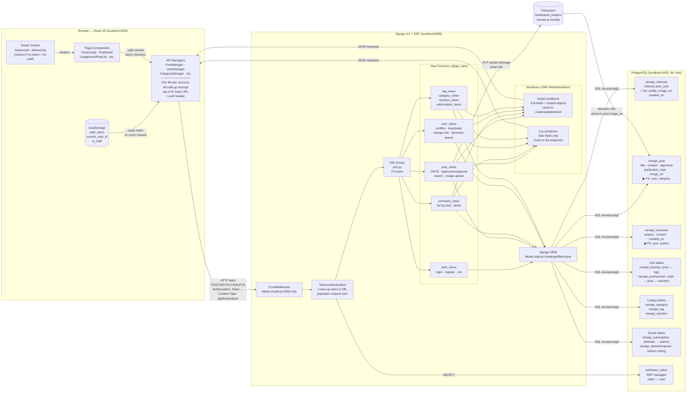

# Rare System Architecture

## Key facts for new developers

| Topic | Detail |
|---|---|
| Auth flow | Login returns a token; client stores it in `localStorage`; every subsequent request sends `Authorization: Token <value>` |
| Admin check | `is_staff` is returned at login and stored client-side. Server re-checks on every admin endpoint. Client-side value goes stale if a role changes mid-session. |
| Post approval | Regular users' posts are created with `approved=False`. Admins' posts are auto-approved. Admins approve via `PUT /posts/:id/approve`. |
| Unapproved post visibility | List endpoints filter to `approved=True`. The single-post detail endpoint (`GET /posts/:id`) does **not** — any authenticated user can read an unapproved post by ID. |
| Image upload | Two separate API calls: `POST /posts` creates the record, then `PUT /posts/:id/image` uploads the file. No rollback if the second call fails. |
| Subscriptions | Soft-deleted: `ended_on` is set instead of deleting the row. Active subscriptions filter on `ended_on__isnull=True`. No other model uses this pattern. |
| Serializers | Each resource has a `DetailSerializer` (full, nested) and a `ListSerializer` (slim). Detail is used for create/update/single responses; List is used for collection endpoints. |
| Error handling | No `.catch()` on any client-side `fetch` call. Failed requests are silent. |
