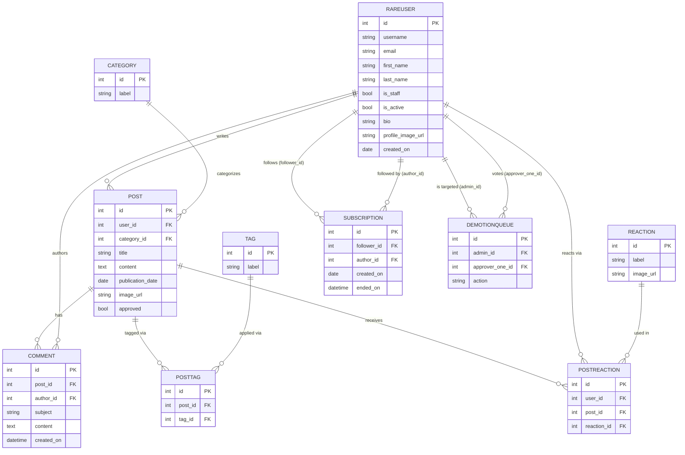

# Rare Database Schema

## Notes

**RAREUSER** extends Django's `AbstractUser`. The fields shown above are the additions and the most relevant inherited fields. `password` (a bcrypt hash) is omitted for clarity.

**POSTTAG** and **POSTREACTION** are explicit through-models rather than Django `ManyToManyField` relations. The ORM does not expose `.tags` or `.reactions` shorthand — views query `PostTag.objects` and `PostReaction.objects` directly.

**SUBSCRIPTION.ended_on** is nullable. A null value means the subscription is active; a set value means it was cancelled. This is the only soft-delete pattern in the schema — all other models use hard deletes.

**DEMOTIONQUEUE** has a `unique_together` constraint on `(action, admin_id, approver_one_id)` preventing duplicate votes. The `action` field is a free-form string with no enforced values. Only one approver field exists (`approver_one_id`), suggesting a multi-approver voting system was planned but not completed.

**POST.approved** controls visibility. List endpoints filter to `approved = true`. The single-record detail endpoint does not filter on this field — any authenticated user can fetch an unapproved post by ID.

**POST.publication_date** is set to today's date by the server on creation. List endpoints also filter `publication_date <= today`, which means the field could support scheduled publishing, but no UI or API surface for that exists yet.
